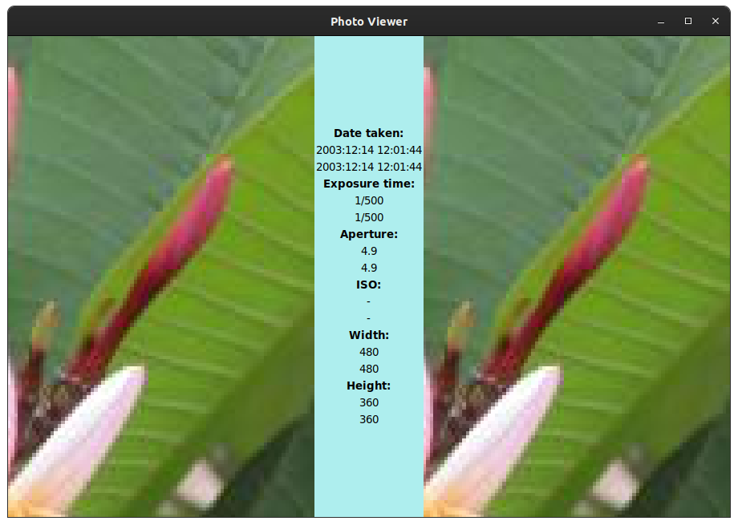

# Photo Viewer Project

A simple tool to compare pictures.

Show photos side by side:


Zoom in to compare details:



### On the MVC paradigm

The model knows nothing about the view or the controller.

The view knows nothing about the controller or the model.

The controller understands both the model and the view.

So in practice for this project:

##### Model

Needs to track:

* photo list
* current photo (primary and echo)
* input folders
* output folder
* photo metadata

There might be a second class that handles the resizing of the picture.

Has to know the current size of the photo\_frame for the calculations.

##### View

Each piece of the view is dependent on a single piece of the model. When some object is modified (e.g. new photo list, next photo, zoom in...) the view is updated accordingly.

Will handle the layout switching.

The structure is:

```
root
    layout containers
        elements
```

##### Controller

Captures user input (with bindings/callbacks/events from tkinter widgets in the view), and binds it to action *on the model*. The view is updated by the callbacks registered on the observables.

### Misc

Yet another iteration of this project, this time following the MVC paradigm. Old version buried in my [snippets](https://github.com/Pitrified/snippet/tree/master/photo-viewer), now it deserves a full repo.
